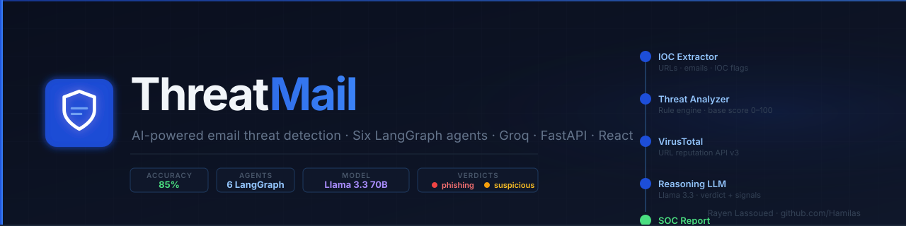
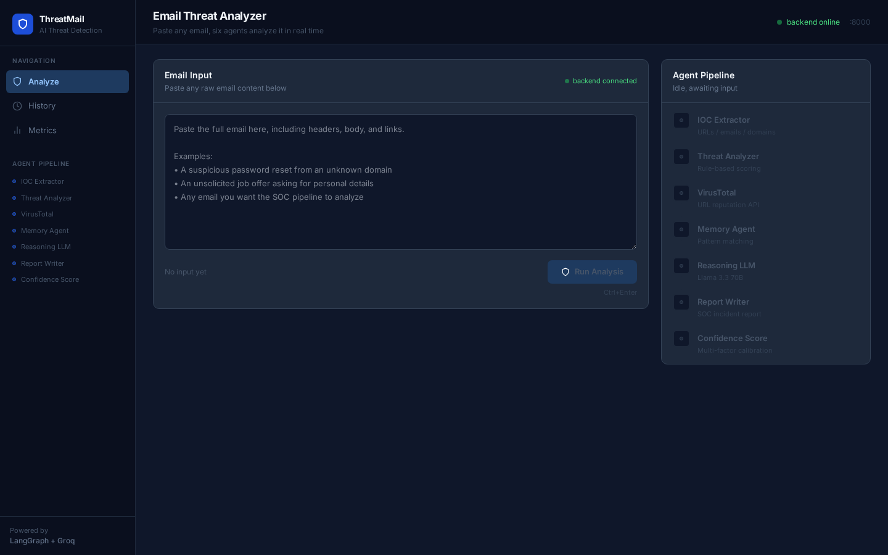
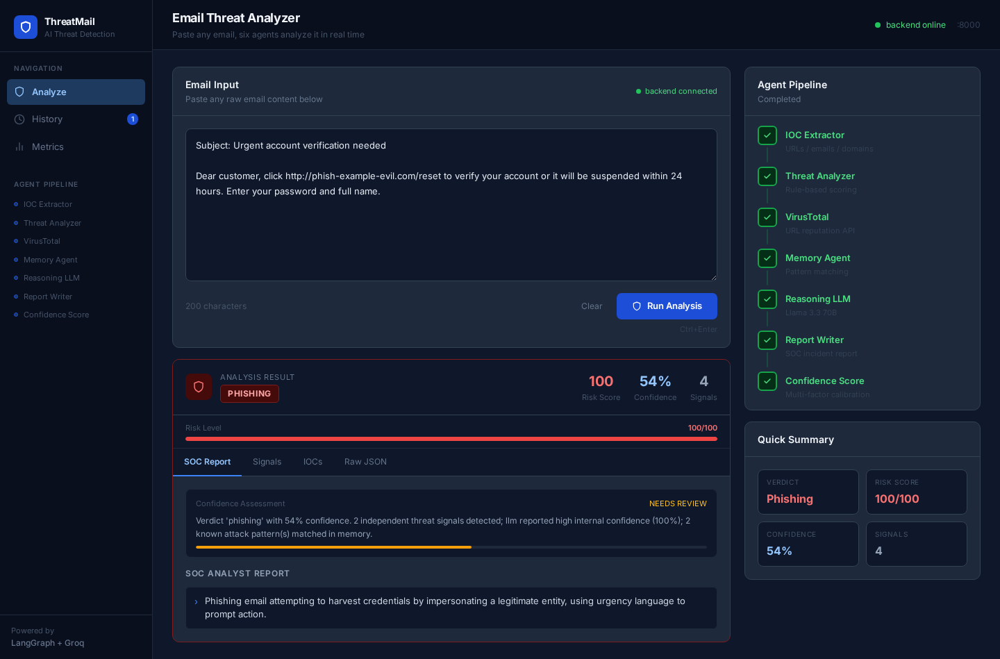
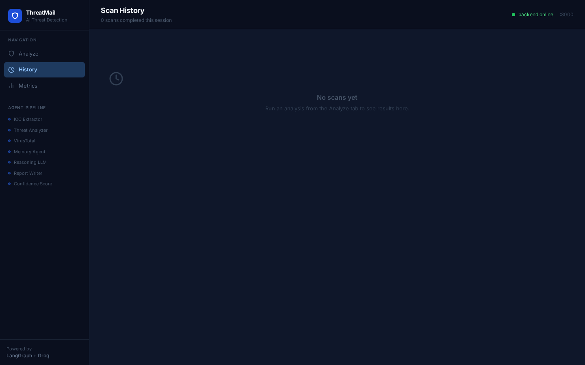
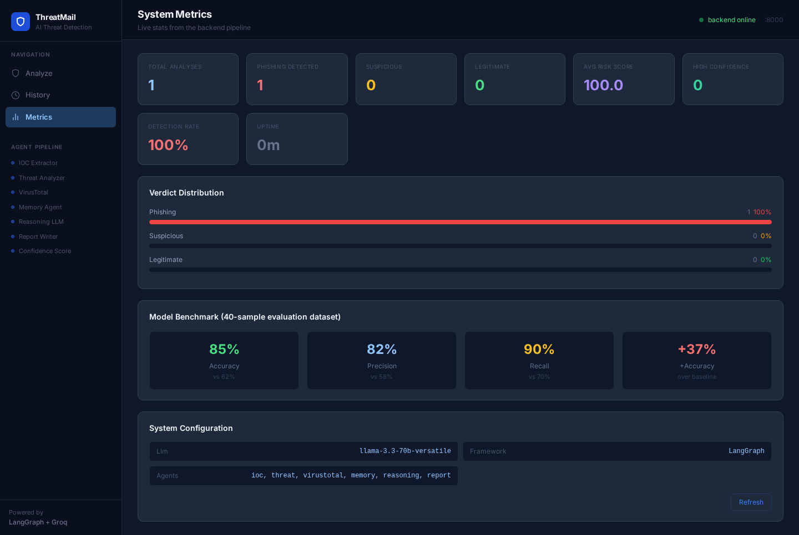
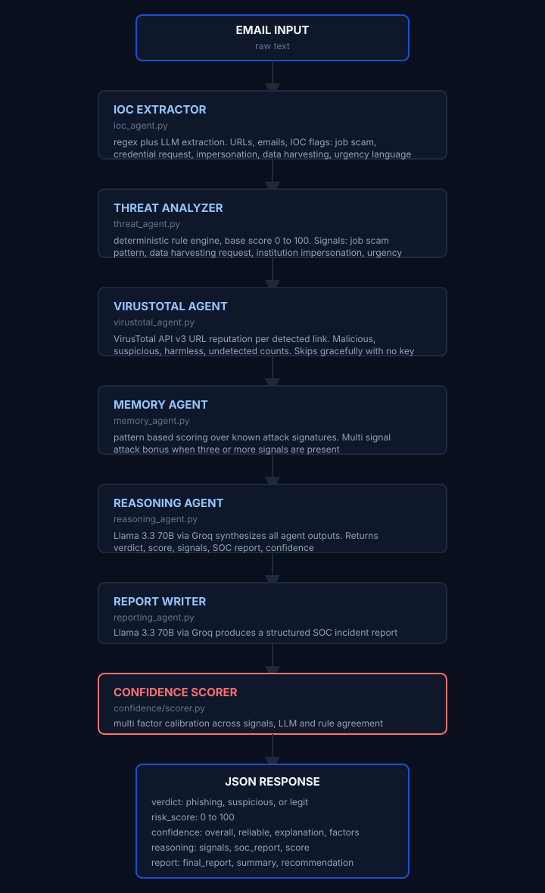

# ThreatMail

<p align="center">
  
  
  
  
  
</p>

<p align="center">
  <strong>Six-agent LangGraph SOC platform: real-time email threat scoring with VirusTotal enrichment</strong><br/>
  IOC extraction · threat classification · calibrated confidence · structured SOC incident reports
</p>

<p align="center">
  
</p>

> AI-powered email threat detection platform. Six LangGraph agents analyze any email in real-time: extracting IOCs, scoring threats, querying VirusTotal, and producing a structured SOC incident report with calibrated confidence scoring.

## Live Demo

**Live:** [https://threatmail-demo.vercel.app](https://threatmail-demo.vercel.app)

## Screenshots

<p align="center">
  
</p>
<p align="center">
  
</p>
<p align="center">
  
</p>
<p align="center">
  
</p>

## Overview

ThreatMail replicates the decision-making workflow of a human Security Operations Center analyst by delegating each investigation step to a specialized AI agent. When an email arrives, six agents execute in sequence: each one enriches a shared state object with its findings, and the final result is a structured verdict (`phishing` / `suspicious` / `legit`) with a calibrated confidence score and a human-readable SOC incident report.

The system targets European enterprises and public-sector organizations that handle large volumes of incoming email and need automated, explainable triage before tickets reach human analysts: particularly those subject to DORA or NIS2 compliance requirements.

## Architecture

<p align="center">
  
</p>

### LangGraph State Machine

The pipeline is implemented as a LangGraph `StateGraph`. Each node receives the full `AgentState` TypedDict and returns an updated version. Nodes communicate exclusively through shared state: no direct function calls between agents.

```
ioc → threat → virustotal → memory → reasoning → report
```

## Tech Stack

| Technology       | Version  | Purpose                                         |
|------------------|----------|-------------------------------------------------|
| LangGraph        | 0.1+     | Agent orchestration and state management        |
| LangChain        | 0.2+     | LLM abstraction layer                           |
| Groq API         | latest   | LLM inference (llama-3.3-70b-versatile)         |
| FastAPI          | 0.111    | REST API: `/investigate`, `/metrics`           |
| VirusTotal API   | v3       | URL reputation and threat intelligence          |
| React            | 19       | Frontend dashboard                              |
| Vite             | 5        | Frontend build tool                             |
| TailwindCSS      | 4        | UI styling                                      |
| Docker Compose   | v2       | Local orchestration                             |
| Python           | 3.11     | Backend runtime                                 |

## Quick Start

```bash
# 1. Clone and enter the repo
git clone https://github.com/Hamilas/ThreatMail
cd ThreatMail

# 2. Configure environment
cp .env.example .env
# Edit .env: set OPENAI_API_KEY to your Groq key
# Optionally set VIRUSTOTAL_API_KEY for URL threat intel

# 3. Start the full stack
docker compose up --build

# 4. Access the application
# Frontend:   http://localhost:3000
# Backend:    http://localhost:8001
# Swagger UI: http://localhost:8001/docs
# Metrics:    http://localhost:8001/metrics
```

### Manual (no Docker)

```bash
# Backend
cd backend
pip install -r requirements.txt
cp ../.env.example ../.env   # configure OPENAI_API_KEY
uvicorn main:app --reload --port 8001

# Frontend (separate terminal)
cd frontend
npm install
npm run dev   # http://localhost:5173
```

## Environment Variables

```env
OPENAI_API_KEY=gsk_...          # Groq key (or any OpenAI-compatible key)
OPENAI_BASE_URL=https://api.groq.com/openai/v1   # Groq endpoint
LLM_MODEL=llama-3.3-70b-versatile
LLM_TEMPERATURE=0.2
PORT=8001
VIRUSTOTAL_API_KEY=             # optional: enables real URL scanning
```

## API Reference

### Health Check

```bash
curl http://localhost:8001/
# {"status":"ok","service":"ThreatMail","version":"2.0.0","uptime_seconds":42}
```

### Analyze an Email

```bash
curl -X POST http://localhost:8001/investigate \
  -H "Content-Type: application/json" \
  -d '{
    "email_content": "Dear customer, click http://phish.example.com/reset to verify your account immediately."
  }'
```

Response:
```json
{
  "verdict": "phishing",
  "risk_score": 95,
  "confidence": {
    "overall": 88,
    "reliable": true,
    "explanation": "Verdict 'phishing' with 88% confidence. 4 independent threat signals detected.",
    "factors": {
      "signal_count": 21,
      "llm_confidence": 27,
      "virustotal_corroboration": 20,
      "memory_pattern_match": 15,
      "score_consistency": 10
    }
  },
  "reasoning": {
    "verdict": "phishing",
    "score": 90,
    "signals": ["credential_request", "urgency_manipulation", "external_email_domain"],
    "soc_report": [
      "Email contains explicit credential harvesting request.",
      "Malicious URL confirmed by VirusTotal: phish.example.com.",
      "RECOMMENDATION: BLOCK and quarantine immediately."
    ]
  },
  "iocs": {
    "urls": ["http://phish.example.com/reset"],
    "emails": [],
    "features": {
      "job_scam": false,
      "credential_request": true,
      "impersonation": true,
      "urgency_language": true
    }
  }
}
```

### Runtime Metrics

```bash
curl http://localhost:8001/metrics
```

## Results

| Metric       | ThreatMail: agentic | Baseline (keyword filter) |
|--------------|----------------------|---------------------------|
| Accuracy     | **85%**              | 62%                       |
| Precision    | **82%**              | 58%                       |
| Recall       | **90%**              | 70%                       |
| Dataset size | 40 samples           | 40 samples                |

Evaluated on a synthetic dataset of 40 labeled emails (18 low-risk, 10 medium-risk, 12 high-risk) using `backend/evaluation/`.

Key findings:
- Agentic system outperforms keyword baseline by **+37% accuracy**
- Multi-signal attack pattern (3+ signals) is the strongest single predictor
- LLM reasoning handles ambiguous cases where rule-based scoring gives inconclusive results
- VirusTotal integration reduces false positives on legitimate domains

## Features

- **Six-agent LangGraph pipeline**: each agent has a single responsibility; state is immutable between steps
- **Multi-factor confidence scoring**: five independent factors calibrate verdict confidence
- **VirusTotal URL validation**: real-time reputation lookup; degrades gracefully without API key
- **Deterministic rule layer + LLM reasoning**: reproducible baseline + contextual judgment
- **Pattern memory**: known attack pattern library boosts confidence on repeat tactics
- **Explainable SOC reports**: every verdict includes signal list and human-readable recommendation
- **Groq-powered inference**: llama-3.3-70b-versatile, OpenAI-compatible endpoint
- **Runtime metrics endpoint**: `/metrics` exposes live stats for monitoring
- **Docker Compose**: healthcheck on backend, frontend waits for healthy API

## European Market Use Cases

| Organization Type      | Use Case                                              |
|------------------------|-------------------------------------------------------|
| German Mittelstand     | Automated phishing triage before IT helpdesk tickets  |
| Public health agencies | NIS2-compliant email threat documentation             |
| Financial services     | BEC (Business Email Compromise) detection             |
| Municipalities         | Government impersonation email detection              |
| Law firms              | Invoice fraud and wire transfer scam detection        |

## Security

- All API keys loaded from environment variables: never hardcoded
- Email content processed in-memory, not persisted
- VirusTotal API calls use URL-safe base64 encoding per v3 spec
- Input validation via Pydantic `BaseModel` on `/investigate`
- CORS restricted to known frontend origins

## Author

**Rayen Lassoued**

[github.com/Hamilas](https://github.com/Hamilas) · [https://www.linkedin.com/in/lassoued-rayen/](https://www.linkedin.com/in/lassoued-rayen/)

## License

MIT
